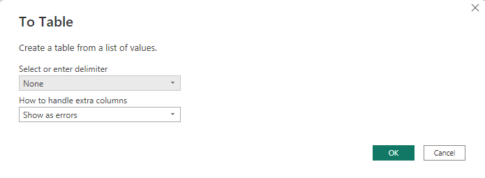

# Azure Data Manager for Energy (ADME) Connector for Power BI

This document will describe how you can connect to ADME with PowerBI to visualize Well data. In Azure this product is called Microsoft Energy Data Services. In this documentation ADME will be used as the name in GA will be Azure Data Manager for Energy. 

The examples below are using an ADME instance with the [TNO dataset](https://github.com/Azure/osdu-data-load-tno). The Power BI connector will work with any ADME instance that has Well data.


## Prerequisites
There are a few things to set up in order to have access and connect to the data. They are listed below, and then each point is further expanded upon in a separate paragraph. 

1. The end user of the Power BI needs to have read access to the ADME instance and the Well data
2. The App registration that was created with the ADME instance needs to have a "Redirect URI" for "Web". For example "http://localhost:8081". 
3. Client secret used for connecting to the ADME instance. Se description below.
4. Download the connector here: 
[Pre-compiled connector](/connector/OSDUWellsConnector.mez)
5. Download the  [PBI Template](/template/PowerBI_Template_ADME_Well_data.pbix)


## Read access to ADME instance
- Add link to entitlements setup


## App registration
Navigate to Azure Active Directory in Azure Portal and choose "App registrations" in the left hand menu. Find the App that was created during the ADME installation. 
Note the following for later use from the overview page:
- Application (client) ID
- Directory (tenant) ID

## Client secret
In the App registration create a secret to be used in the connector. Note it down for use later.

## Connector configuration
The [Pre-compiled connector](/connector/OSDUWellsConnector.mez) must be placed in \Documents\Power BI Desktop\Custom Connectors on your computer. 

Change the file extention from .mez to .zip, and open the zip file. Inside you will find a file called config.json. Make a copy of this file and place outside of the zip file. 

Open the config.json file and fill inn the values. 
- client_id - The client id associated with ADME instance. 
- client_secret - The secret generated for the client_id.
- tenant_id - Id of the Microsoft tenant 
- Redirect URL - see prerequisites.  
- osdu_host - DNS host for the ADME instance. For example "https://admedev.energy.azure.com"
- partition_id - The data partition id. This can be found in Azure Portal if you open the AMDE (currently called Microsoft Energy Data Services) instance and choose Data Partitions under Advanced in the menu on the left.

```
{
  "client_id": "<client_id>",
  "client_secret": "<client_secret>",
  "scopes": "<client_id>/.default",
  "auth_callback_url": "http://localhost:8081",
  "auth_token_url": "https://login.microsoftonline.com/<tenant_id>/oauth2/v2.0/token",
  "auth_authorize_url": "https://login.microsoftonline.com/<tenant_id>/oauth2/v2.0/authorize",
  "osduindexsearchendpoint": "<dns host for instance>/api/search/v2/query",
  "data_partition_id": "<data_partition_id>"
}
```

Save and copy the updated config.json file back into the zip file (replacing the one that came with the connector). Then rename the file back to .mez. Remember that the connector must be in \Documents\Power BI Desktop\Custom Connectors

## Power BI setup

1. Open Power BI Desktop. 
2. Go to File - Options and settings - Options - Security
3. Under "Data Extentions" choose "Allow any extention to load without validation or warning". 
4. Click OK


## Open the Power BI Template

Open the [Power BI Template](/template/PowerBI_Template_ADME_Well_data.pbix). The template already contain some test data and an example of how a report can look.


## Connect Power BI template to ADME instance

In the Power BI Template file choose Get data in the menu. Click on the icon and not the drop down list to get a full menu. 


Choose "Other" and then the OSDU connector as shown below. 

<span style="color:red">
Tips:</span> 
: If you dont have the connector in your list then check that you have the connector with .mez ending in the Custom connector folder as described earlier in this documentation. On some computer you might have multiple users and Custom connector folders. Add the connector to one folder at the time until you have found the one the Power BI uses.


### Search example

This search will return 100 records of Well data. 

osdu:wks:master-data--Well:*


The first time you do this you probably will get a pop up box asking you to sign in. 

 <span style="color:red">
Tips:</span> 
: If you have problems signing in, make sure your user have proper access to the data in ADME.  

[OSDU CLI](https://community.opengroup.org/osdu/ui/data-loading/osdu-cli) and 
[Postman Collection](https://github.com/EirikHaughom/ADME/tree/main/Guides/Postman%20Collection) are two good options to communicate with ADME and check/give entitlements.


## Query results and data preparation

The results of the query will look something like this:


Click "To table" in the upper left corner and then "OK" without changing the two drop down boxes. 



Click on the two arrows highlighted below and choose OK to get all information.


The data is then ready to be used

